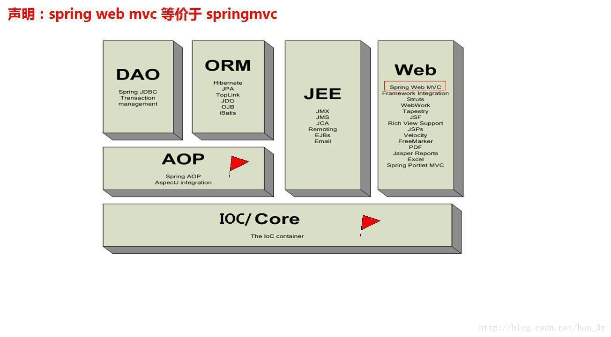
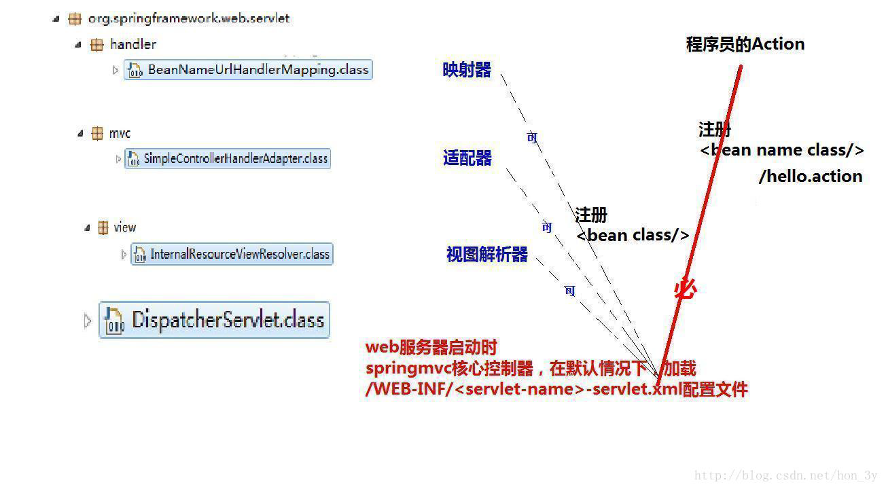
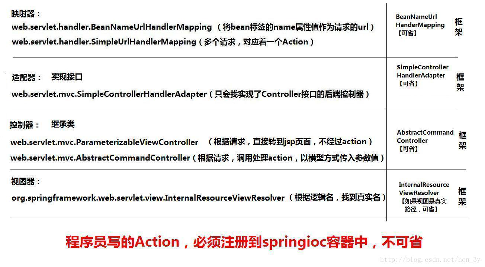
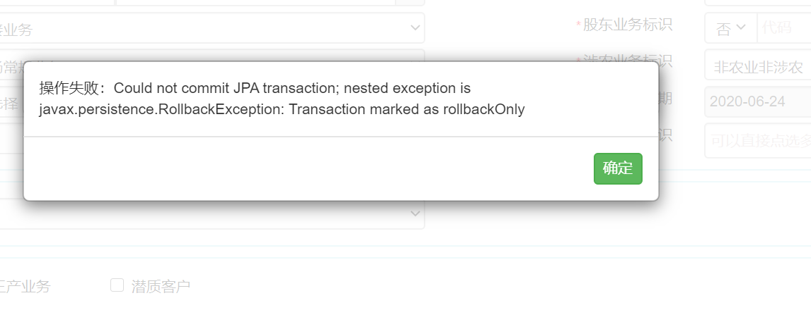

# 新车险系统学习第4天

## 主要任务

1. 继续阅读学习PrpTEdit系列页面功能的js实现和java实现，主要集中在几个查询、证件识别接口的调用。
2. 学习springMVC的一些内容。

> ## springMVC
>
> ## 什么是SpringMVC?
>
> - SpringMVC是Spring家族的⼀员，Spring是将现在开发中流⾏的组件进⾏组合⽽成的⼀个框架！它⽤在
>   基于MVC的表现层开发，类似于struts2框架
>
>   
>
> ## SpringMVC快速⼊⻔
>
> ### 1、导⼊开发包
>
> - 如果⽤Maven的，那导⼊Maven依赖即可
> - 前6个是Spring的核⼼功能包【IOC】，第7个是关于web的包，第8个是SpringMVC包
>   - org.springframework.context-3.0.5.RELEASE.jar
>   - org.springframework.expression-3.0.5.RELEASE.jar
>   - org.springframework.core-3.0.5.RELEASE.jar
>   - org.springframework.beans-3.0.5.RELEASE.jar
>   - org.springframework.asm-3.0.5.RELEASE.jar
>   - commons-logging.jar
>   - org.springframework.web-3.0.5.RELEASE.jar
>   - org.springframework.web.servlet-3.0.5.RELEASE.jar
>
> ### 2、编写Action
>
> - Action实现Controller接⼝
>
>   ```java
>   public class HelloAction implements Controller {
>   	@Override
>   	public ModelAndView handleRequest(javax.servlet.http.HttpServletRequest httpServletRequest, javax.servlet.http.HttpServletResponse httpServletResponse) throws Exception {
>   		return null;
>   	}
>   }
>   ```
>
> - 我们只要实现`handleRequest⽅法`即可，该⽅法已经有了request和response对象给我们⽤了。这是我们⾮常熟悉的request和response对象。然⽽该⽅法返回的是ModelAndView这么⼀个对象，这是和Struts2不同的。Struts2返回的是字符串，⽽SpringMVC返回的是ModelAndView
>
> - ModelAndView其实他就是将我们的视图路径和数据封装起来⽽已【我们想要跳转到哪，把什么数据存到request域中，设置这个对象的属性就⾏了】。
>
>   ```java
>   public class HelloAction implements Controller {
>       @Override
>       public ModelAndView handleRequest(javax.servlet.http.HttpServletRequest httpServletRequest, javax.servlet.http.HttpServletResponse httpServletResponse) throws Exception {
>           ModelAndView modelAndView = new ModelAndView();
>           //跳转到hello.jsp⻚⾯。
>           modelAndView.setViewName("/hello.jsp");
>           return modelAndView;
>       }
>   }
>   ```
>
> ### 3、注册核⼼控制器
>
> - 我们使⽤SpringMVC的话，我们是在web.xml中配置核⼼控制器
>
>   ```xml
>   <!-- 注册springmvc框架核⼼控制器 -->
>       <servlet>
>           <servlet-name>DispatcherServlet</servlet-name>
>           <servletclass>org.springframework.web.servlet.DispatcherServlet</servlet-class>
>           
>           <!--到类⽬录下寻找我们的配置⽂件-->
>           <init-param>
>               <param-name>contextConfigLocation</param-name>
>               <param-value>classpath:hello.xml</param-value>
>           </init-param>
>       </servlet>
>       <servlet-mapping>
>           <servlet-name>DispatcherServlet</servlet-name>
>           <!--映射的路径为.action-->
>           <url-pattern>*.action</url-pattern>
>       </servlet-mapping>
>   ```
>
> ### 4、创建SpringMVC控制器
>
> - 我们在hello.xml配置⽂件中把SpringMVC的控制器创建出来
>
>   ```xml
>   <!--
>   注册控制器
>   name属性的值表示的是请求的路径【也就是说，当⽤户请求到/helloAction时，就交由
>   HelloAction类进⾏处理】
>   -->
>   <bean class="HelloAction" name="/hello.action"></bean>
>   ```
>
> ### 5、访问
>
> - 当我们在浏览器访问http://localhost:8080/hello.action 的时候，Spring会读取到我们的访问路径，然后对⽐⼀下我们的配置⽂件中是否有配置/hello.action ，如果有。那么就交由对应的Action类来进⾏处理。Action类的业务⽅法将其请求输出到hello.jsp⻚⾯上。
>
> ## SpringMVC⼯作流程
>
> 
>
> - ⽤户发送请求
> - 请求交由核⼼控制器处理
> - 核⼼控制器找到映射器，映射器看看请求路径是什么
> - 核⼼控制器再找到适配器，看看有哪些类实现了Controller接⼝或者对应的bean对象
> - 将带过来的数据进⾏转换，格式化等等操作
> - 找到我们的控制器Action，处理完业务之后返回⼀个ModelAndView对象
> - 最后通过视图解析器来对ModelAndView进⾏解析
> - 跳转到对应的JSP/html⻚⾯
>
> ### 1、映射器
>
> - 我们在web.xml中配置规定**只要是.action为后缀的请求都是会经过SpringMVC的核⼼Servlet。**
>
> - 当我们接收到请求的时候，我们发现是hello.action，是会经过我们的核⼼Servlet的，那么**核⼼Servlet就会去找有没有专⻔的Action类来处理hello.action请求的。**
>
> - 也就是说：**映射器就是⽤于处理“什么样的请求提交给Action”处理。【默认可省略的】.....**
>
> - 其实我们在快速⼊⻔的例⼦已经配置了：**name属性就是规定了hello.action到HelloAction控制器中处理！**
>
>   ```xml
>   <!--
>   注册控制器
>   name属性的值表示的是请求的路径【也就是说，当⽤户请求到/helloAction时，就交由HelloAction类进⾏处理】
>   -->
>   <bean class="HelloAction" name="/hello.action"></bean>
>   ```
>
>   映射器默认的值是这样的：
>
>   ```xml
>   <!-- 注册映射器(handler包)(框架)【可省略】 -->
>   <bean class="org.springframework.web.servlet.handler.SimpleUrlHandlerMapping"></bean>
>   ```
>
> - 当然了，上⾯我们在创建控制器的时候【也就是HelloAction】可以不使⽤name属性来指定路径，可以使⽤我们的映射器来配置。如以下的代码：
>
>   ```xml
>   <bean class="HelloAction" id="helloAction"></bean>
>   <!-- 注册映射器(handler包)(框架) -->
>   <bean class="org.springframework.web.servlet.handler.SimpleUrlHandlerMapping">
>       <property name="mappings">
>           <props>
>               <prop key="/hello.action">helloAction</prop>
>           </props>
>       </property>
>   </bean>
>   ```
>
> - 当我们需要多个请求路径都交由helloAction控制器来处理的话，我们只要添加prop标签就⾏了！
>
>   ```xml
>   <bean class="org.springframework.web.servlet.handler.SimpleUrlHandlerMapping">
>       <property name="mappings">
>           <props>
>               <prop key="/hello.action">helloAction</prop>
>               <prop key="/bye.action">helloAction</prop>
>           </props>
>       </property>
>   </bean>
>   ```
>
> ### 2、适配器
>
> - 当我们映射器找到对应的Action来处理请求的时候，核⼼控制器会**让适配器去找该类是否实现了Controller接⼝。【默认可省略的】**
>
> - 也就是说：**适配器就是去找实现了Controller接⼝的类**
>
>   ```xml
>   <!-- 适配器【可省略】 -->
>   <bean class="org.springframework.web.servlet.mvc.SimpleControllerHandlerAdapter"></bean>
>   ```
>
> ### 3、视图解析器
>
> - 我们把结果封装到ModelAndView以后，SpringMVC会使⽤视图解析器来对ModelAndView进⾏解析。【默认可省略的】
>
> - 也有⼀种情况是不能省略的。**我们在快速⼊⻔的例⼦中，将结果封装到ModelAndView中，⽤的是绝对真实路径**！如果我们⽤的是逻辑路径，那么就必须对其配置，否则SpringMVC是找不到对应的路径的。
>
> - 在Action中返回hello，**hello是⼀个逻辑路径。需要我们使⽤视图解析器把逻辑路基补全**
>
>   ```java
>   public ModelAndView handleRequest(javax.servlet.http.HttpServletRequest httpServletRequest, javax.servlet.http.HttpServletResponse httpServletResponse) throws Exception {
>       ModelAndView modelAndView = new ModelAndView();
>       //跳转到hello.jsp⻚⾯。
>       modelAndView.setViewName("hello");
>       return modelAndView;
>   }
>   ```
>
>   如果不使⽤视图解析器的话，那么就会找不到⻚⾯。因此，我们需要配置视图解析器
>
>   ```xml
>   <!--
>   如果Action中书写的是视图逻辑名称，那么视图解析器就必须配置
>   如果Action中书写的是视图真实名称，那么视图解析器就可选配置
>   -->
>   <bean class="org.springframework.web.servlet.view.InternalResourceViewResolver">
>       <!-- 路径前缀 -->
>       <property name="prefix" value="/"/>
>       <!-- 路径后缀 -->
>       <property name="suffix" value=".jsp"/>
>       <!-- 前缀+视图逻辑名+后缀=真实路径 -->
>   </bean>
>   ```
>
> ## AbstractCommandController
>
> - 到⽬前为⽌，我们都没有讲SpringMVC是怎么接收web端传递过来的参数的。
>
> - 那么我们在SpringMVC中是怎么获取参数的呢？？？？我们是**将Action继承AbstractCommandController这么⼀个类的。**
>
>   ```java
>   public class HelloAction extends AbstractCommandController {
>       @Override
>       protected ModelAndView handle(HttpServletRequest httpServletRequest, HttpServletResponse httpServletResponse, Object o, BindException e) throws Exception {
>           return null;
>       }
>   }
>   ```
>
> - 在讲解该控制器之前，⾸先我们要明⽩**SpringMVC的控制器是单例的。**
>
> - 也就是说：SpringMVC作为单例的，是**不可能使⽤成员变量来进⾏接收的【因为会有多个⽤户访问，就会出现数据不合理性】！**
>
> - 那么SpringMVC作为单例的，他**只能通过⽅法的参数来进⾏接收对应的参数！只有⽅法才能保证不同的⽤户对应不同的数据！**
>
>   
>
>   
>
> ### 1、实体
>
> 实体的属性要和web⻚⾯上的name提交过来的名称是⼀致的。
>
> ```java
> public class User {
>     private String id;
>     private String username;
> 
>     public User() {
>     }
> 
>     public User(String id, String username) {
>         this.id = id;
>         this.username = username;
>     }
> 
>     public String getId() {
>         return id;
>     }
> 
>     public void setId(String id) {
>         this.id = id;
>     }
> 
>     public String getUsername() {
>         return username;
>     }
> 
>     public void setUsername(String username) {
>         this.username = username;
>     }
> 
>     @Override
>     public String toString() {
>         return "User{" + "id='" + id + '\'' + ", username='" + username + '\'' + '}';
>     }
> 
> }
> ```
>
> ### 2、提交参数的JSP
>
> ```jsp
> <form action="${pageContext.request.contextPath}/hello.action" method="post">
>     <table align="center">
>         <tr>
>             <td>⽤户名：</td>
>             <td><input type="text" name="username"></td>
>         </tr>
>         
>         <tr>
>             <td>编号</td>
>             <td><input type="text" name="id"></td>
>         </tr>
>         
>         <tr>
>             <td colspan="2">
>             <input type="submit" value="提交">
>             </td>
>         </tr>
>     </table>
> </form>
> ```
>
> 
>
> ### 3、 配置Action处理请求
>
> ```xml
> <bean class="HelloAction" id="helloAction"></bean>
> <!-- 注册映射器(handler包)(框架) -->
> <bean class="org.springframework.web.servlet.handler.SimpleUrlHandlerMapping">
>     <property name="mappings">
>         <props>
>         	<prop key="/hello.action">helloAction</prop>
>         </props>
>     </property>
> </bean>
> ```
>
> ### 4、 Action接收参数
>
> ```java
> public class HelloAction extends AbstractCommandController {
> 
>     /*设置⽆参构造器，⾥边调⽤setCommandClass⽅法，传⼊要封装的对象*/
>     public HelloAction() {
>         this.setCommandClass(User.class);
>     }
> 
>     /**
>     *
>     * @param httpServletRequest
>     * @param httpServletResponse
>     * @param o 这⾥的对象就表示已经封装好的了User对象了。！
>     * @param e
>     * @return
>     * @throws Exception
>     */
>     @Override
>     protected ModelAndView handle(HttpServletRequest httpServletRequest, HttpServletResponse httpServletResponse, Object o, BindException e) throws Exception {
>         User user = (User) o;
>         System.out.println(user);
>         ModelAndView modelAndView = new ModelAndView();
>         //跳转到ok.jsp
>         modelAndView.setViewName("/WEB-INF/ok.jsp");
>         //将数据封装到ModelAndView中
>         modelAndView.addObject("USER", user);
>         return modelAndView;
>     }
> }
> ```
>
> 

## PrpTEdit系列页面

身份证和驾驶证的识别在prptOcr.js中

## 晚上6点培训

主要内容：关于非车系统的规则审核，

## 遇到问题

1. changeRisk的代码中，有部分id在页面上找不到。
2. js中跳转地址拼凑字段中有`contextPath`这一变量，是从何处获得的。
3. 业务员选择那块的代码在哪个位置。

4. 好像无法暂存