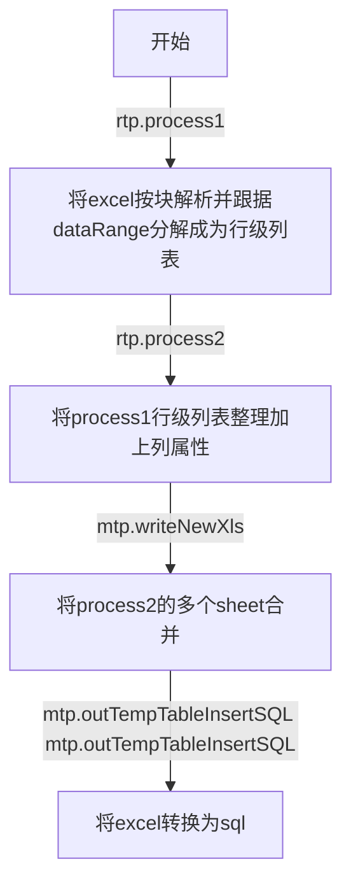

# 费率代码

1. 版本
2. 费率类别（或地区），机构前两位。
3. 车辆大类（A0，H0）
4. 车辆属性（8A，8B）
5. 座位数（0~6）
6. 载质量
7. 特殊业务标志
8. 新车购置价
9. 保额/赔偿限额
10. 玻璃类型
11. 拖拉机功率
12. 绝对免赔案
13. 车龄
14. 摩托车排量
15. 扩展区域半径
16. 是否投保不计免赔

insert into xxx

（riskcode, kindcode, rateperiod, validdate, ratecode, currency, basepremium, rate, flag, validstatus）value

# 费率工程代码

## RateTableParser类

### process1方法

- 参数：xlsName文件名
- 加载xls文件和xml规则
- 创建输出的xls文件
- 遍历sheet，按块解析，parse方法
- 写入输出xls文件，在对应的路径以对应的名字。

### parse方法

- 参数：输入表，规则，输出表

- 读取规则中关于块服务的数据
- 从第一个数据单元格开始按行列遍历，使用getActualCell方法判定是否有值，使用containsKey验证键值对。
- 使用getDistList4Row方法，按照data范围拆分xls
- 跟据sameRowDataRange进行同行合并（如费率和费用），使用Range类的方法对字符串进行解析。
- 将cell存到一个链表中，遍历这个链表，将cell放入

### getDistList4Row方法

- 拆解一个data以及他的所有条件
- 获取数据区域和全部区域
- 将有数据的值加到list里面，
- 处理纵向参数和横向条件。即处理range和datarange之间的数据。
- 返回list。

### getActualCell方法

- 根据给定的cell和sameDataRange的配置信息，找到实际存在值的那
  个cell

### process2方法

- 参数：xlsName文件名
- 加载xls文件和xml规则
- 创建输出的xls文件
- 遍历sheet，通过sheetname.endwtih找到对应规则，交由dealForProcess2方法处理

### dealForProcess2方法

- 处理表标题，主要是表头的各种属性
- 通过规则中的condition和getSelectedRows方法，筛选险种
- 跟据sort数据依次向行中填入值

### getSelectedRows方法

- 遍历sheetin，筛选出符合条件的行数。
- 输出list。

## MergerTableParser类

### writeNewXls方法

- 合并sheet
- 循环遍历xls文件，写到一个sheet中

### getRateModelList方法

- 将xls文件作为一个RateModal类list输出
- 使用ExcelUtils.getData将表读取为一个字符串矩阵
- getRowDate方法：将有顺序的字符串序列导入一个RateModel类

### RateModal类

- 主要是按照费率需要的参数，设置一个接收和处理数据的类。

### outTempTableInsetSQL方法

- 跟据list，拼凑sql语句

## XmlPaeser类

- 该类下只有一个方法

### xml2Obj方法

- 参数 ： 任意类型对象obj（类模板）、xml路径
- 将xml转换为相应对象

## Question

1.  `Serializer.read`  好像现在只能找到XmlSerializer的资料
3. 规则文件中include和exclude的作用
4. sameDataRange是干什么的，主要是getActualCell的作用
4. cellTemp和cellActul的区别