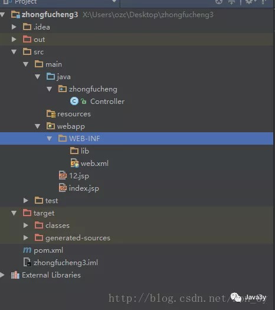

本文是我学习Java面向对象编程时的笔记，大部分内容来自廖雪峰的Java教程和java3y的公众号。

<!-- more -->

# Maven

- Maven是一个Java项目管理和构建工具，它可以定义项目结构、项目依赖，并使用统一的方式进行自动化构建，是Java项目不可缺少的工具。
- Maven是一个采用纯Java编写的开源项目管理工具, Maven采用了一种被称之为Project Object Model (POM)概念来管理项目，所有的项目配置信息都被定义在一个叫做POM.xml的文件中..
- Maven主要服务于**基于Java平台的项目构建、依赖管理和项目信息管理**…
- POM：
  - **我们使用Java是面向对象编程，对象就是我们的类**
  - **而Maven是面向项目，把我们的项目看做成是一个对象来进行管理**

## 1、why maven

- **Maven可以管理项目的整个声明周期，包括清除、编译，测试，报告、打包、部署等等。**

- **自动构建项目**

  - 软件开发： 可行性分析、需求分析、软件设计、软件开发、发布、运维

  - 软件构建： 软件已经开发完毕，需要构建成一个产品进行发布
  - 构建步骤： 清除--> 编译-->测试-->报告-->打包（jar\war）-->安装-->部署到远程 

    *maven可以**通过一个命令实现自动构建软件项目***

- Maven拥有“约定优于配置“这么一个理念，也就是说，把一些规范约定下来，人们就这么用！**如果我们事先约定好所有项目的目录结构，标准开发过程(编译，测试) , 所有人都遵循这个约定。软件项目的管理就会变得简单很多**。

- 

