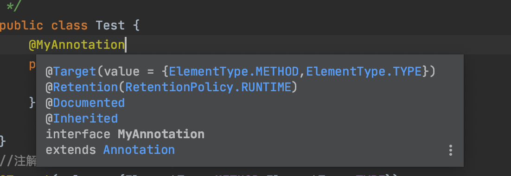

本文是我学习Java反射和注解时的笔记，大部分内容来自廖雪峰的Java教程和java3y的公众号。

<!-- more -->

# 反射

## 1、反射

- 动态语言和讲台语言

  - 动态语言是一类在运行时可以改变其结构的语言:例如新的函数、对象、甚至代码可以被引进，已有的 函数可以被删除或是其他结构上的变化。通俗点说就是在运行时代码可以根据某些条件改变自 身结构。主要动态语言:Object-C、C#、JavaScript、PHP、Python等。
  - 静态语言与动态语言相对应的，运行时结构不可变的语言就是静态语言。如Java、C、C++。 Java不是动态语言，但Java可以称之为“准动态语言”。即Java有一定的动态性，我们可以利用 反射机制获得类似动态语言的特性。Java的动态性让编程的时候更加灵活!

- Reflection(反射)是Java被视为动态语言的关键，反射机制允许程序在执行期借助于Reflection API取

  得任何类的内部信息，并能直接操作任意对象的内部属性及方法。

  ```java
  Class c=Class.forName("java.lang.String")
  ```

- Java**反射机制提供的功能**

  - 在运行时构造任意一个类的对象 
  - 在运行时判断任意一个类所具有的成员变量和方法 
  - 在运行时获取泛型信息 
  - 在运行时调用任意一个对象的成员变量和方法 
  - 在运行时处理注解
  - 生成动态代理

- Java**反射优点和缺点**

  - 优点:可以实现动态创建对象和编译，体现出很大的灵活性 !

  - 缺点:对性能有影响。使用反射基本上是一种解释操作，我们可以告诉JVM，我们希望做什么并且它满 足我们的要求。这类操作总是慢于 直接执行相同的操作。

## 2、Class实例

- `class`是由**JVM**在执行过程中动态加载的。**JVM**在第一次读取到一种`class`类型时，将其加载进内存。每加载一种`class`，**JVM**就为其创建一个`Class`类型的实例，并关联起来。这个`Class`实例是**JVM**内部创建的，如果我们查看**JDK**源码，可以发现`Class`类的构造方法是`private`，只有**JVM**能创建`Class`实例，我们自己的**Java**程序是无法创建`Class`实例的。

- 由于JVM为每个加载的`class`创建了对应的`Class`实例，并在实例中保存了该`class`的所有信息，包括类名、包名、父类、实现的接口、所有方法、字段等，因此，如果获取了某个`Class`实例，我们就可以通过这个`Class`实例获取到该实例对应的`class`的所有信息。这种通过`Class`实例获取`class`信息的方法称为反射（`Reflection`）

  - Class 本身也是一个类
  - Class 对象只能由系统建立对象
  -  一个加载的类在 JVM 中只会有一个Class实例 
  - 一个Class对象对应的是一个加载到JVM中的一个.class文件 
  - 每个类的实例都会记得自己是由哪个 Class 实例所生成 
  - 通过Class可以完整地得到一个类中的所有被加载的结构 
  - Class类是Reflection的根源，针对任何你想动态加载、运行的类，唯有先获得相应的Class对象

- **哪些类型可以有****Class****对象?**

  - class:外部类，成员(成员内部类，静态内部类)，局部内部类，匿名内部类。 
  - interface:接口
  -  []:数组
  - enum:枚举
  - annotation:注解@interface 
  - primitive type:基本数据类型 
  - void

- 在Object类中定义了以下的方法，此方法将被所有子类继承

  ```java
  public final Class getClass();
  ```

  以上的方法返回值的类型是一个Class类，此类是Java反射的源头，实际上所谓反射从程序的运行结果来 看也很好理解，即:可以通过对象反射求出类的名称。

- 如何获取一个`class`的`Class`实例？有三个方法：

  - 直接通过一个`class`的静态变量`class`获取：
  
    ```java
    Class cls = String.class;
    ```
  
  - 如果我们有一个实例变量，可以通过该实例变量提供的`getClass()`方法获取：
  
    ```java
    String s = "Hello"; 
    Class cls = s.getClass();
    ```
  
  - 如果知道一个`class`的完整类名，可以通过静态方法`Class.forName()`获取：
  
    ```java
    Class cls = Class.forName("java.lang.String");
    ```
  
  - 只针对内置的基本数据类型:
  
    ```java
    Class cls = Integer.TYPE;
    ```
  
- 获取父类的class:`getSuperclass()`;

  ```java
  Class cls = cls2.getSuperclass();
  ```

  - 如果是两个`Class`实例，要判断一个向上转型是否成立，可以调用`isAssignableFrom()`：

    ```java
    Integer.class.isAssignableFrom(Integer.class); // true，因为Integer可以赋值给Integer
    Number.class.isAssignableFrom(Integer.class); // true，因为Integer可以赋值给Number
    Object.class.isAssignableFrom(Integer.class); // true，因为Integer可以赋值给Object
    Integer.class.isAssignableFrom(Number.class); // false，因为Number不能赋值给Integer
    ```

### 3、Class实例方法

- 对任意的一个`Object`实例，只要我们获取了它的`Class`，就可以获取它的一切信息。一个类只对应一个Class对象。

  | **方法名**                              | **功能说明**                                                 |
  | --------------------------------------- | ------------------------------------------------------------ |
  | static ClassforName(String name)        | 返回指定类名name的Class对象                                  |
  | Object newInstance()                    | 调用缺省构造函数，返回Class对象的一个实例                    |
  | getName()                               | 返回此Class对象所表示的实体(类，接口，数组类或 void)的名称。 |
  | Class getSuperClass()                   | 返回当前Class对象的父类的Class对象                           |
  | Class[] getinterfaces()                 | 获取当前Class对象的接口                                      |
  | ClassLoader getClassLoader()            | 返回该类的类加载器                                           |
  | Constructor[] getConstructors()         | 返回一个包含某些Constructor对象的数组                        |
  | Method getMothed(String name,Class.. T) | 返回一个Method对象，此对象的形参类型为paramType              |
  | Field[] getDeclaredFields()             | 返回Field对象的一个数组                                      |

- 我们先看看如何通过`Class`实例获取字段信息。`Class`类提供了以下几个方法来获取字段：

  - `Field getField(name)`：根据字段名获取某个`public`的`field`（包括父类）
  - `Field getDeclaredField(name)`：根据字段名获取当前类的某个`field`（不包括父类）
  - `Field[] getFields()`：获取所有`public`的`field`（包括父类）
  - `Field[] getDeclaredFields()`：获取当前类的所有`field`（不包括父类）

- ```java
  Class stdClass = Student.class;
  // 获取public字段"score":
  System.out.println(stdClass.getField("score"));//public int Student.score
  // 获取继承的public字段"name":
  System.out.println(stdClass.getField("name"));//public java.lang.String Person.name
  // 获取private字段"grade":
  System.out.println(stdClass.getDeclaredField("grade"));//private int Student.grade
   
  ```

  ```java
  class Student extends Person {
      public int score;
      private int grade;
  }
  
  class Person {
      public String name;
  }
  ```

- 一个`Field`对象包含了一个字段的所有信息：

  - `getName()`：返回字段名称，例如，`"name"`；
  - `getType()`：返回字段类型，也是一个`Class`实例，例如，`String.class`；
  - `getModifiers()`：返回字段的修饰符，它是一个`int`，不同的bit表示不同的含义。

- ```java
  public final class String {
      private final byte[] value;
  }
  
  Field f = String.class.getDeclaredField("value");
  f.getName(); // "value"
  f.getType(); // class [B 表示byte[]类型
  int m = f.getModifiers();
  Modifier.isFinal(m); // true
  Modifier.isPublic(m); // false
  Modifier.isProtected(m); // false
  Modifier.isPrivate(m); // true
  Modifier.isStatic(m); // false
  ```

- 用`Field.get(Object)`获取指定实例的指定字段的值。在调用`Object value = f.get(p);`前，先写一句：`Field.setAccessible(true)`。调用`Field.setAccessible(true)`的意思是，别管这个字段是不是`public`，一律允许访问。由此一来，反射可以获取`private`字段的值。但是`setAccessible`有时也会失败。

- 通过Field实例既然可以获取到指定实例的字段值，自然也可以设置字段的值。设置字段值是通过`Field.set(Object, Object)`实现的，

- ```java
  Person p = new Person("Xiao Ming");
  System.out.println(p.getName()); // "Xiao Ming"
  Class c = p.getClass();
  Field f = c.getDeclaredField("name");
  f.setAccessible(true);
  f.set(p, "Xiao Hong");
  System.out.println(p.getName()); // "Xiao Hong"
  ```

- 用`getInterfaces`获取接口实例

- ```java
  Class s = Integer.class;
  Class[] is = s.getInterfaces();
  ```

- 要特别注意：`getInterfaces()`只返回当前类直接实现的接口类型，并不包括其父类实现的接口类型。如果一个类没有实现任何`interface`，那么`getInterfaces()`返回空数组。

- `Class`类提供了以下几个方法来获取`Method`：

  - `Method getMethod(name, Class...)`：获取某个`public`的`Method`（包括父类）
  - `Method getDeclaredMethod(name, Class...)`：获取当前类的某个`Method`（不包括父类）
  - `Method[] getMethods()`：获取所有`public`的`Method`（包括父类）
  - `Method[] getDeclaredMethods()`：获取当前类的所有`Method`（不包括父类）

- 一个`Method`对象包含一个方法的所有信息：

  - `getName()`：返回方法名称，例如：`"getScore"`；
  - `getReturnType()`：返回方法返回值类型，也是一个Class实例，例如：`String.class`；
  - `getParameterTypes()`：返回方法的参数类型，是一个Class数组，例如：`{String.class, int.class}`；
  - `getModifiers()`：返回方法的修饰符，它是一个`int`，不同的bit表示不同的含义。

- 对`Method`实例调用`invoke`就相当于调用该方法，`invoke`的第一个参数是对象实例，即在哪个实例上调用该方法，后面的可变参数要与方法参数一致，否则将报错。

- 为了调用非public方法，我们通过`Method.setAccessible(true)`允许其调用

- 使用反射调用方法时，仍然遵循多态原则：即总是调用实际类型的覆写方法（如果存在）

- ```java
  // 获取Person的hello方法:
  Method h = Person.class.getMethod("hello");
  // 对Student实例调用hello方法:
  h.invoke(new Student());
  //最终调用Student.hello
  ```

## 3、class实例构造方法

- 我们通常使用`new`操作符创建新的实例

- ```java
  Person p = new Person();
  ```

  如果通过反射来创建新的实例，可以调用Class提供的`newInstance()`方法：

  ```java
  Person p = Person.class.newInstance();// 相当于使用new调用无参构造实例
  ```

  调用`Class.newInstance()`的局限是，它只能调用该类的`public`无参数构造方法。如果构造方法带有参数，或者不是`public`，就无法直接通过`Class.newInstance()`来调用。

- 为了调用任意的构造方法，Java的反射API提供了`Constructor`对象，它包含一个构造方法的所有信息，可以创建一个实例。

- 通过Class实例获取Constructor的方法如下：

  - `getConstructor(Class...)`：获取某个`public`的`Constructor`；
  - `getDeclaredConstructor(Class...)`：获取某个`Constructor`；
  - `getConstructors()`：获取所有`public`的`Constructor`；
  - `getDeclaredConstructors()`：获取所有`Constructor`。

- 调用非`public`的`Constructor`时，必须首先通过`setAccessible(true)`设置允许访问。`setAccessible(true)`可能会失败。

  ```java
  class A{
  	public A(){
  		System.out.println("无参构造器");
  	}
  	public A(int a){
  		System.out.println("int 有参构造器"+a);
  	}
  	private A(String b,String a){
  		System.out.println("私有String 有参构造器"+b+a);
  	}
  }
  
  public class Main {
  	public static void main(String[] args) throws Exception, SecurityException {
  		Class clz = A.class;
  		//获得所有构造器：getDeclaredConstructors()返回所有权限的构造器、getConstructors()返回public权限的构造器
  		Constructor[] c = clz.getDeclaredConstructors();
  		for (Constructor constructor : c) {
  			System.out.println(constructor);
  		}
  		//或得某一个 构造器
  		Constructor<A> c1 = clz.getDeclaredConstructor(String.class,String.class);//私有
  		System.out.println(c1);
  		Constructor<A> c2 = clz.getConstructor();//公共
  		System.out.println(c2);
      Constructor<A> c3 = clz.getConstructor(int.class);//公共有参
  		System.out.println(c2);
  		//通过public构造器 创建对象
  		A a = c2.newInstance(new Object[]{});//创建对象时调用无参构造器 打印输出："无参构造器"
  		// 通过private构造器 创建对象
  		c1.setAccessible(true);//设置成可以通过私有构造器 创建对象
  		A b = c1.newInstance(new Object[]{"1111","2222"});//打印输出：  私有String 有参构造器11112222
  	}
  }
  ```


## 4、动态代理

- Java的`class`和`interface`的区别：

  - 可以实例化`class`（非`abstract`）
  - 不能实例化`interface`

- `代理(Proxy)`是一种设计模式,提供了间接对目标对象进行访问的方式;即通过代理对象访问目标对象。

  这样做的好处是:可以在目标对象实现的功能上,增加额外的功能补充,即扩展目标对象的功能。这就符合了设计模式的开闭原则，即在对既有代码不改动的情况下进行功能的扩展。

- 静态代理：在使用静态代理时,被代理对象与代理对象需要一起实现相同的接口或者是继承相同父类，因此要定义一个接口或抽象类。

  ```java
  	// 接口
      interface IStar {
          void sing();
      }
  	// 真实对象
      class LDHStar implements IStar {
          @Override
          public void sing() {
              System.out.println("刘德华唱歌");
          }
  
      }
  	// 代理类需要有真实对象的控制权 (引用)
      class ProxyManger implements IStar {   
     			// 真实对象的引用
          private IStar star;
          
          public ProxyManger() {
              super();
          }
  
          public ProxyManger(IStar star) {
              super();
              this.star = star;
          }
          
          @Override
          public void sing() {
  　　　　　　System.out.println("唱歌前准备");
      　　　 star.sing();
     　　　　System.out.println("善后工作");
          }
      }
  		class Test{
  			public static void main(String[] args) {
              // 创建明星对象
              IStar ldh = new LDHStar();
              ProxyManger proxy = new ProxyManger(ldh);
              proxy.sing();
          }
  }
  ```

  - 优点：可以做到在不修改目标对象的功能前提下,对目标功能扩展.
  - 因为代理对象需要与目标对象实现一样的接口,所以会有很多代理类,类太多.同时,一旦接口增加方法,目标对象与代理对象都要维护.

- Java标准库提供了一种动态代理（Dynamic Proxy）的机制：可以在运行期动态创建某个`interface`的实例。

  - 还有一种方式是动态代码，我们仍然先定义了接口`Hello`，但是我们并不去编写实现类，而是直接通过JDK提供的一个`Proxy.newProxyInstance()`创建了一个Hello接口对象。这种没有实现类但是在运行期动态创建了一个接口对象的方式，我们称为动态代码。JDK提供的动态创建接口对象的方式，就叫`动态代理`。
  - 在运行期动态创建一个`interface`实例的方法如下：	

```java
  public class Main {
    public static void main(String[] args) {
      	//定义一个InvocationHandler实例，它负责实现接口的方法调用；
        InvocationHandler handler = new InvocationHandler () {
            @Override
            public Object invoke(Object proxy, Method method, Object[] args) throws Throwable {
                System.out.println(method);
                if (method.getName().equals("morning")) {
                    System.out.println("Good morning, " + args[0]);
                }
                return null;
            }
        };
      	//通过Proxy.newProxyInstance()创建interface实例，它需要3个参数：
        Hello hello = (Hello) Proxy.newProxyInstance(
            Hello.class.getClassLoader(), // ClassLoader，通常就是接口类的ClassLoader
            new Class[] { Hello.class }, // 传入要实现的接口，至少需要传入一个接口进去
            handler); // 传入处理调用方法的InvocationHandler实例
        hello.morning("Bob");
    }
  }
	//将返回的Object强制转型为接口
  interface Hello {
    void morning(String name);
  }
```


# 注解

## 1、什么是注解

- 注解(Annotation)是JDK5.0开始引入的新技术，它其实就是**代码中的特殊标记**，这些标记可以**在编译、类加载、运行时被读取，并执行相对应的处理**。

- 注解不是程序本身，但是可以对程序作出解释，可以被其他程序（编译器）读取。注解是以`@注释名`的形式存在，可以添加一些参数。

- 传统的方式，我们是通过**配置文件(xml文件)来告诉类是如何运行的**。有了注解技术以后，注解可以附加在packages，class，method，field上，我们就可以**通过注解告诉他们该 如何运行**。**注解可以给类、方法上注入信息，相当于为他们添加了附加信息。**

- Java的注解可以分为三类：

  1. 第一类是由编译器使用的注解，例如：

     - `@Override`：让编译器检查该方法是否正确地实现了覆写；
     - `@SuppressWarnings`：告诉编译器忽略此处代码产生的警告。

     这类注解不会被编译进入`.class`文件，它们在编译后就被编译器扔掉了。

  2. 第二类是由工具处理`.class`文件使用的注解，比如有些工具会在加载class的时候，对class做动态修改，实现一些特殊的功能。这类注解会被编译进入`.class`文件，但加载结束后并不会存在于内存中。这类注解只被一些底层库使用，一般我们不必自己处理。

  3. 第三类是在程序运行期能够读取的注解，它们在加载后一直存在于JVM中，这也是最常用的注解。例如，一个配置了`@PostConstruct`的方法会在调用构造方法后自动被调用（这是Java代码读取该注解实现的功能，JVM并不会识别该注解）。

  

## 2、注解的使用

- Java语言使用`@interface`语法来定义注解（`Annotation`），它的格式如下：

  ```java
  public @interface Report {
      int type() default 0;
      String level() default "info";
      String value() default "";
  }
  ```

  - 使用 @interface自定义注解时 , 自动继承了java.lang.annotation.Annotation接口

  - 注解的参数类似无参数方法，方法的名称就是参数的名称。可以用`default`设定一个默认值（强烈推荐）。最常用的参数应当命名为`value`。

  - 如果参数名称为value，可以不写`value=`。

    ```java
    //只有一个参数, 默认名字一般是value.使用可省略不写 
    @MyAnnotation3("aaa")
    public void test2(){}
    ```

- 在注解上**定义的成员变量只能是String、数组、Class、枚举类、注解**

- 怎么把注解上的信息注入到方法上呢？？？我们**利用的是反射技术**

  步骤可分为三部：

  - **反射出该类的方法**
  - **通过方法得到注解上具体的信息**
  - **将注解上的信息注入到方法上**

- 我们**通过注解来让该方法拥有这两个变量**！

  ```java
      //注解拥有什么属性，在修饰的时候就要给出相对应的值
      @MyAnnotation(username = "zhongfucheng", age = 20)
      public void add(String username, int age) {
  
      }
  ```

  - 我们可以在**注解声明属性的时候，给出默认值**。那么在修饰的时候，就可以不用具体指定了。
  
    ```java
      public @interface MyAnnotation {
      
          //定义了两个成员变量
          String username() default "zicheng";
          int age() default 23;
      }
      
        @MyAnnotation()
        public void add(String username, int age) {
    
        }
    ```
  
    
  
  - 还有一种特殊的情况，如果**注解上只有一个属性，并且属性的名称为value**，那么在使用的时候，我们可以不写value，直接赋值给它就行
  
  ```java
  public @interface MyAnnotation2 {
  
      String value();
  }
  
  @MyAnnotation2("zhongfucheng")
  public void find(String id) {
  
  }
  ```
  
  

## 3、元注解

有一些注解可以修饰其他注解，这些注解就称为元注解（meta annotation）。Java标准库已经定义了一些元注解，我们只需要使用元注解，通常不需要自己去编写元注解。

1. @Retention**用于指定被修饰的Annotation被保留多长时间。**需要在什么级别保存该注释信息，即在哪个阶段还有效。

2. @Target用于描述注解的使用范围(即:被描述的注解可以用在什么地方)。
3. @Documented说明该注解将被包含在javadoc中。

2. @Inherited说明子类可以继承父类中的该注解。

```java
//注解可以用在什么地方：方法，类型
@Target(value = {ElementType.METHOD,ElementType.TYPE})
//表示需要在什么级别保存该注释信息，即在哪个阶段还有效
@Retention(RetentionPolicy.RUNTIME)
//说明该注解将被包含在javadoc中
@Documented
//说明子类可以继承父类中的该注解
@Inherited
@interface MyAnnotation{}
```


## 4、基本注解


- 在java.lang包下存在着5个基本的Annotation，其中有3个Annotation我们是非常常见的了。

1. @override**重写注解**

   - @Overried只用于修饰方法，表示一个方法声明打算重写超类中的另一个方法声明。

   - @Overried是告诉编译器要检查**该方法是实现父类的**…可以帮我们避免一些低级的错误…比如，我们在实现equals()方法的时候，把euqals()打错了，那么**编译器就会发现该方法并不是实现父类的，与注解@Override冲突，于是就会给予错误**。

2. @Deprecated**过时注解**

   - @Deprecated可以用于修辞方法,属性,类,表示不鼓励程序员使用这样的元素,通常是因为它很危险或者存在更好的选择。但是只是过时了, 并不是不能使用!

   - Java在设计的时候，可能觉得某些方法设计得不好，**为了兼容以前的程序，是不能直接把它抛弃的，于是就设置它为过时**。当我们在程序中调用它的时候，在IDE上会出现一条横杠，说明该方法是过时的。

3. @SuppressWarnings**抑制编译器警告注解**

   - 该注解在我们写程序的时候并不是很常见，我们可以用它来**让编译器不给予我们警告**。在类上添加了@SuppressWarnings这个注解，那么编译器就不会给予我们警告了
   - 你需要添加一-个参数才能正确使用，这些参数都是已经定义好了的,我们选择性的使用就好了.
     1. @SuppressWarnings(“all”)
     2. @SuppressWarnings(“unchecked”)
     3. @SuppressWarnings(value={“unchecked”,“deprecation”})

4. @SafeVarargs **Java 7“堆污染”警告**

   - 什么是堆污染呢？？**当把一个不是泛型的集合赋值给一个带泛型的集合的时候**，这种情况就很容易发生堆污染….

5. @FunctionalInterface**用来指定该接口是函数式接口**

   - 用该注解**显示指定**该接口是一个函数式接口。


