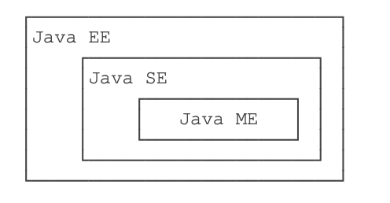
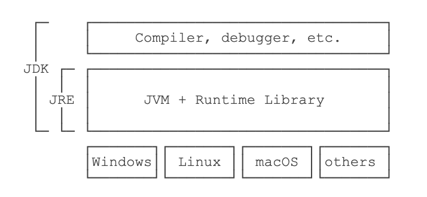

本文是我学习JavaSE时的笔记，大部分内容来自廖雪峰的Java教程和java3y的公众号。笔记内容主要是Java的基础语法部分。

<!-- more -->

# java基础

## 一、什么是Java

### 1、JavaSE



- Java SE就是标准版，包含标准的JVM和标准库，
- Java EE是企业版，它只是在Java SE的基础上加上了大量的API和库，以便方便开发Web应用、数据库、消息服务等，Java EE的应用使用的虚拟机和Java SE完全相同。
- Java ME就和Java SE不同，它是一个针对嵌入式设备的“瘦身版”，Java SE的标准库无法在Java ME上使用，Java ME的虚拟机也是“瘦身版”。

### 2、JDK与JRE



- JRE就是运行Java字节码的虚拟机。
- 但是，如果只有Java源码，要编译成Java字节码，就需要JDK；
- JDK除了包含JRE，还提供了编译器、调试器等开发工具。
- JSR是一系列的规范，从JVM的内存模型到Web程序接口，全部都标准化了。而负责审核JSR的组织就是JCP。

### 3、白皮书关键术语

- 面向对象：重点在数据对象和对象的接口上
- 网络能力：能够通过url打开和访问网络上的对象
- 健壮性：java编译器能够检测出一些其他语言仅在运行时才能检测出的错误；java不需要指针来构造数据结构，在必要时却能具有指针的能力
- 可移植性：数据类型规范
- 多线程：带来更好的交互和响应

## 二、java程序基础

### 1、基本数据类型

- 整数类型：`byte`，`short`，`int`，`long`

  - `byte`：-128 ~ 127
  - `short`: -32768 ~ 32767
  - `int`: -2147483648 ~ 2147483647
  - `long`: -9223372036854775808 ~ 9223372036854775807

- 浮点数类型：`float`，`double`

  ```java
  float f2 = 3.14e38f; // 科学计数法表示的3.14x10^38（对于float类型，需要加上f后缀。）
  double d3 = 4.9e-324; // 科学计数法表示的4.9x10^-324
  //float类型可最大表示3.4x1038，而double类型可最大表示1.79x10308。
  ```

- 字符类型：`char`

- 布尔类型：`boolean`

- 定义变量的时候，如果加上`final`修饰符，这个变量就变成了常量（根据习惯，常量名通常全部大写。）

### 2、计算

- 普通运算、自增自减

- 移位计算、与或运算

- 由于浮点数存在运算误差，所以比较两个浮点数是否相等常常会出现错误的结果。正确的比较方法是判断两个浮点数之差的绝对值是否小于一个很小的数:

  ```java
  double r = Math.abs(x - y);
  ```

- 溢出：`NaN`表示**Not a Number**   `Infinity`表示无穷大   `-Infinity`表示负无穷大

- 三元计算  `b ? x : y`会首先计算**b**，如果**b**为`true`，则只计算**x**，否则，只计算**y**

### 3、字符串

- `\n `表示换行符

- `\r` 表示回车符

- `\t` 表示Tab

- 从Java 13开始//预览功能//，字符串可以用`"""..."""`表示多行字符串（`Text Blocks`）了。举个例子：

  ```java
  String s = """
  	         SELECT * FROM
  	           users
  	         WHERE id > 100
  	         ORDER BY name DESC
             """;
  ```

  - 上述多行字符串实际上是5行，在最后一个`DESC`后面还有一个`\n`。如果我们不想在字符串末尾加一个`\n`，就需要这么写：`ORDER BY name DESC"""`;
  - 多行字符串前面共同的空格会被去掉

- 字符串匹配：两个`String`类型，它们的内容是相同的，但是，分别指向不同的对象，用`==`判断，结果为`false`，要判断引用类型的变量内容是否相等，必须使用`equals()`方法：`s1.equals(s2)`

### 4、循环和流程

- `while`循环是先判断循环条件，再执行循环。而另一种`do while`循环则是先执行循环，再判断条件，条件满足时继续循环，条件不满足时退出。

- Java还提供了另一种`for each`循环，它可以更简单地遍历数组：

  ```java
    int[]ns={1,4,9,16,25};
    for(intn:ns){
      System.*out*.println(n);
    }
  ```

- `break`和`continue`

### 5、数组操作

- 直接打印数组变量，得到的是数组在**JVM**中的引用地址
- 我们只需要调用**JDK**提供的`Arrays.sort()`就可以排序
- `Arrays.deepToString()`二维数组变字符串


