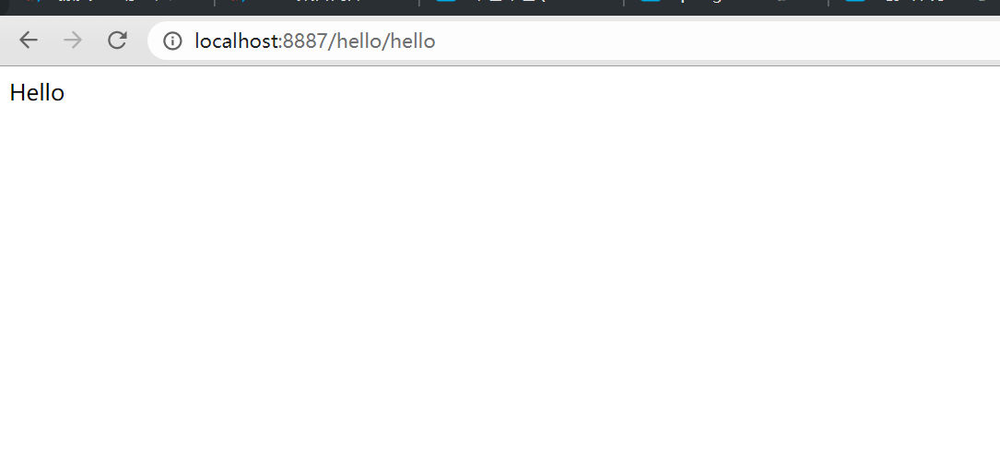
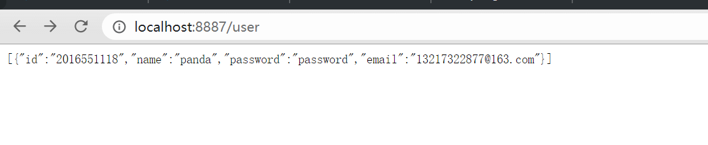

本文是我学习SpringBoot是的笔记，资源来自互联网。
<!-- more -->

# SpringBoot

## 一、什么是SpringBoot

## 二、快速开始

### 1、从idea创建SpringBoot项目

1. 新建idea maven项目，不勾选依赖。

2. 在pom中加入以下依赖，作用见注释

   ```xml
           <!-- SpringBoot启动器  -->
           <dependency>
               <groupId>org.springframework.boot</groupId>
               <artifactId>spring-boot-starter</artifactId>
           </dependency>
   
           <!--Web依赖-->
           <dependency>
               <groupId>org.springframework.boot</groupId>
               <artifactId>spring-boot-starter-web</artifactId>
           </dependency>
   
   ```

3. 编写control类

   ```java
   @Controller
   @RequestMapping("/hello")
   public class HelloController {
       @ResponseBody
       @GetMapping("/hello")
       public String Hello(){
           return "Hello";
       }
   }
   ```

   

   

4. 在application.yml中设置端口等信息

   ```yml
   #服务端容器的配置
   server:
     port: 8887
   ```

5. 点击application的run方法，启动服务。

### 2、使用JPA访问数据库

1. 导入JPA依赖

   ```xml
           <!-- MySQL的java驅動 -->
           <dependency>
               <groupId>mysql</groupId>
               <artifactId>mysql-connector-java</artifactId>
           </dependency>
           
           <!--spring data jpa-->
           <dependency>
               <groupId>org.springframework.boot</groupId>
               <artifactId>spring-boot-starter-data-jpa</artifactId>
           </dependency>
   ```

2. 跟据数据编写实体类

   ```java
   @Entity // jpa的注解，需要加
   @Data // lombok
   public class User implements Serializable{
       @Id
       private String id;
   
       private String name;
   
       private String password;
   
       private String email;
   }
   ```

3. 编写 Repository类

   ```java
   //参数为实体类类型和主键类型
   public interface UserRepository extends JpaRepository<User, String> {
   
   }
   ```

4. 编写Service类（可省略）

   ```java
   // 接口
   public interface UserService {
       List<User> getAllUser();
   }
   
   // 实现
   @Service
   public class UserServiceImpl implements UserService {
   
       @Autowired
       private UserRepository userRepository;
   
       @Override
       public List<User> getAllUser() {
           return userRepository.findAll();
       }
   }
   ```

5. 编写control类

   ```java
   @RestController
   public class UserController {
   
       @Autowired
       private UserService userService;
   
       /**
        * 得到所有用户
        */
       @GetMapping(value = "/user", produces = {"application/json;charset=UTF-8"})
       public List<User> getAllUser () {
   
           List<User> allUser = userService.getAllUser();
   		//早命令行输出
           for (User user : allUser) {
               System.out.println(user);
           }
   		//在页面输出
           return  allUser;
       }
   }
   ```

   

### 3、导入静态资源和使用thymeleaf

1. 导入依赖包

   ```xml
   <!--静态资源依赖包 -->
   <dependency>
       <groupId>org.webjars</groupId>
       <artifactId>jquery</artifactId>
       <version>3.5.1</version>
   </dependency>
   ```

2. 访问对应目录

   


3. 静态资源放到正确的目录下

   

   - 这三个目录都可以识别，优先级resources>static>public
   - 这三个目录下的index.html文件会被识别为首页

4. 使用thymeleaf

   - thymeleaf的所有模板引擎写在templates文件夹下

     

   - 是用controller映射地址

     ```java
     @Controller
     public class testController {
         @RequestMapping("/test")
         public String test(){
             return "test";
         }
     }
     ```

     

   - 在controller中引入model，绑定参数。导入thymeleaf头文件，使用语法。

     ```java
     @Controller
     public class testController {
         @RequestMapping("/test")
         public String test(Model model){
             model.addAttribute("msg","hello,springboot");
             return "test";
         }
     }
     ```

     ```html
     <!DOCTYPE html>
     <!--导入thymeleaf头文件-->
     <html lang="en" xmlns:th = "http://www.thymeleaf.org">
     <head>
         <meta charset="UTF-8">
         <title>Data</title>
     </head>
     <body>
         <!--th：后可以跟使用htnl元素，用法类似v- -->
         <div th:text="${msg}"></div>
     </body>
     </html>
     ```

   5. thymeleaf示例

      ```html
      <!DOCTYPE html>
      <html lang="en" xmlns:th = "http://www.thymeleaf.org">
      <head>
        <meta charset="UTF-8">
        <title>Data</title>
      </head>
        <body>
        
        <!--
            model.addAttribute("msg","<h1>hello,springboot</h1>");
            model.addAttribute("users", Arrays.asList("panda","xiaohong","xiaoming"));
        -->
        
        <div th:utext="${msg}"></div>
        
        <h3 th:each="user:${users}" th:text="${user}"></h3>
        <h2>另一种方法</h2>
        <h3 th:each="user:${users}">[[${user}]]</h3>
        
        </body>
        </html>
      ```
      
        

  ### 4、使用SpringMVC

1. 写一个配置类，添加@Configuration的注解，并实现WebMvcConfigurer接口。

   ```java
   //扩展springmvc
   @Configuration
   public class MyMVCConfig implements WebMvcConfigurer {...}
   ```

2. 接管视图解析器

   


