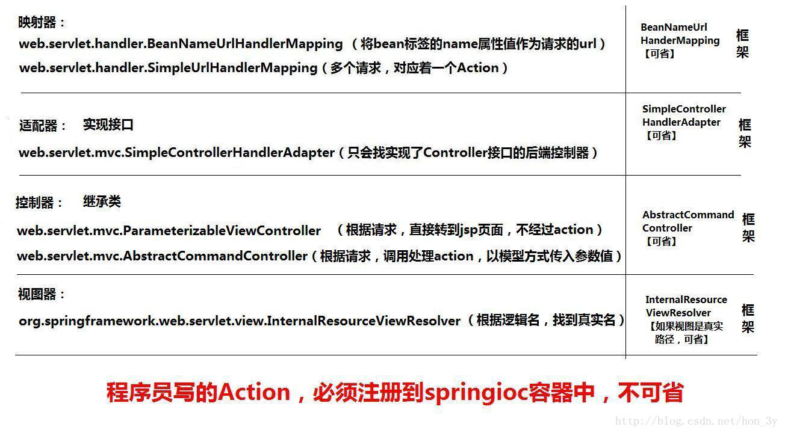

本文是我学习SpringMVC是的笔记，资源来自互联网。
<!-- more -->

# SpringMVC 

## 什么是SpringMVC?

- SpringMVC是Spring家族的⼀员，Spring是将现在开发中流⾏的组件进⾏组合⽽成的⼀个框架！它⽤在
  基于MVC的表现层开发，类似于struts2框架

  

## SpringMVC快速⼊⻔

### 1、导⼊开发包

- 如果⽤Maven的，那导⼊Maven依赖即可
- 前6个是Spring的核⼼功能包【IOC】，第7个是关于web的包，第8个是SpringMVC包
  - org.springframework.context-3.0.5.RELEASE.jar
  - org.springframework.expression-3.0.5.RELEASE.jar
  - org.springframework.core-3.0.5.RELEASE.jar
  - org.springframework.beans-3.0.5.RELEASE.jar
  - org.springframework.asm-3.0.5.RELEASE.jar
  - commons-logging.jar
  - org.springframework.web-3.0.5.RELEASE.jar
  - org.springframework.web.servlet-3.0.5.RELEASE.jar

### 2、编写Action

- Action实现Controller接⼝

  ```java
  public class HelloAction implements Controller {
  	@Override
  	public ModelAndView handleRequest(javax.servlet.http.HttpServletRequest httpServletRequest, javax.servlet.http.HttpServletResponse httpServletResponse) throws Exception {
  		return null;
  	}
  }
  ```

- 我们只要实现`handleRequest⽅法`即可，该⽅法已经有了request和response对象给我们⽤了。这是我们⾮常熟悉的request和response对象。然⽽该⽅法返回的是ModelAndView这么⼀个对象，这是和Struts2不同的。Struts2返回的是字符串，⽽SpringMVC返回的是ModelAndView

- ModelAndView其实他就是将我们的视图路径和数据封装起来⽽已【我们想要跳转到哪，把什么数据存到request域中，设置这个对象的属性就⾏了】。

  ```java
  public class HelloAction implements Controller {
      @Override
      public ModelAndView handleRequest(javax.servlet.http.HttpServletRequest httpServletRequest, javax.servlet.http.HttpServletResponse httpServletResponse) throws Exception {
          ModelAndView modelAndView = new ModelAndView();
          //跳转到hello.jsp⻚⾯。
          modelAndView.setViewName("/hello.jsp");
          return modelAndView;
      }
  }
  ```

### 3、注册核⼼控制器

- 我们使⽤SpringMVC的话，我们是在web.xml中配置核⼼控制器

  ```xml
  <!-- 注册springmvc框架核⼼控制器 -->
      <servlet>
          <servlet-name>DispatcherServlet</servlet-name>
          <servletclass>org.springframework.web.servlet.DispatcherServlet</servlet-class>
          
          <!--到类⽬录下寻找我们的配置⽂件-->
          <init-param>
              <param-name>contextConfigLocation</param-name>
              <param-value>classpath:hello.xml</param-value>
          </init-param>
      </servlet>
      <servlet-mapping>
          <servlet-name>DispatcherServlet</servlet-name>
          <!--映射的路径为.action-->
          <url-pattern>*.action</url-pattern>
      </servlet-mapping>
  ```

### 4、创建SpringMVC控制器

- 我们在hello.xml配置⽂件中把SpringMVC的控制器创建出来

  ```xml
  <!--
  注册控制器
  name属性的值表示的是请求的路径【也就是说，当⽤户请求到/helloAction时，就交由
  HelloAction类进⾏处理】
  -->
  <bean class="HelloAction" name="/hello.action"></bean>
  ```

### 5、访问

- 当我们在浏览器访问http://localhost:8080/hello.action 的时候，Spring会读取到我们的访问路径，然后对⽐⼀下我们的配置⽂件中是否有配置/hello.action ，如果有。那么就交由对应的Action类来进⾏处理。Action类的业务⽅法将其请求输出到hello.jsp⻚⾯上。

## SpringMVC⼯作流程


- ⽤户发送请求
- 请求交由核⼼控制器处理
- 核⼼控制器找到映射器，映射器看看请求路径是什么
- 核⼼控制器再找到适配器，看看有哪些类实现了Controller接⼝或者对应的bean对象
- 将带过来的数据进⾏转换，格式化等等操作
- 找到我们的控制器Action，处理完业务之后返回⼀个ModelAndView对象
- 最后通过视图解析器来对ModelAndView进⾏解析
- 跳转到对应的JSP/html⻚⾯

### 1、映射器

- 我们在web.xml中配置规定**只要是.action为后缀的请求都是会经过SpringMVC的核⼼Servlet。**

- 当我们接收到请求的时候，我们发现是hello.action，是会经过我们的核⼼Servlet的，那么**核⼼Servlet就会去找有没有专⻔的Action类来处理hello.action请求的。**

- 也就是说：**映射器就是⽤于处理“什么样的请求提交给Action”处理。【默认可省略的】.....**

- 其实我们在快速⼊⻔的例⼦已经配置了：**name属性就是规定了hello.action到HelloAction控制器中处理！**

  ```xml
  <!--
  注册控制器
  name属性的值表示的是请求的路径【也就是说，当⽤户请求到/helloAction时，就交由HelloAction类进⾏处理】
  -->
  <bean class="HelloAction" name="/hello.action"></bean>
  ```

  映射器默认的值是这样的：

  ```xml
  <!-- 注册映射器(handler包)(框架)【可省略】 -->
  <bean class="org.springframework.web.servlet.handler.SimpleUrlHandlerMapping"></bean>
  ```

- 当然了，上⾯我们在创建控制器的时候【也就是HelloAction】可以不使⽤name属性来指定路径，可以使⽤我们的映射器来配置。如以下的代码：

  ```xml
  <bean class="HelloAction" id="helloAction"></bean>
  <!-- 注册映射器(handler包)(框架) -->
  <bean class="org.springframework.web.servlet.handler.SimpleUrlHandlerMapping">
      <property name="mappings">
          <props>
              <prop key="/hello.action">helloAction</prop>
          </props>
      </property>
  </bean>
  ```

- 当我们需要多个请求路径都交由helloAction控制器来处理的话，我们只要添加prop标签就⾏了！

  ```xml
  <bean class="org.springframework.web.servlet.handler.SimpleUrlHandlerMapping">
      <property name="mappings">
          <props>
              <prop key="/hello.action">helloAction</prop>
              <prop key="/bye.action">helloAction</prop>
          </props>
      </property>
  </bean>
  ```

### 2、适配器

- 当我们映射器找到对应的Action来处理请求的时候，核⼼控制器会**让适配器去找该类是否实现了Controller接⼝。【默认可省略的】**

- 也就是说：**适配器就是去找实现了Controller接⼝的类**

  ```xml
  <!-- 适配器【可省略】 -->
  <bean class="org.springframework.web.servlet.mvc.SimpleControllerHandlerAdapter"></bean>
  ```

### 3、视图解析器

- 我们把结果封装到ModelAndView以后，SpringMVC会使⽤视图解析器来对ModelAndView进⾏解析。【默认可省略的】

- 也有⼀种情况是不能省略的。**我们在快速⼊⻔的例⼦中，将结果封装到ModelAndView中，⽤的是绝对真实路径**！如果我们⽤的是逻辑路径，那么就必须对其配置，否则SpringMVC是找不到对应的路径的。

- 在Action中返回hello，**hello是⼀个逻辑路径。需要我们使⽤视图解析器把逻辑路基补全**

  ```java
  public ModelAndView handleRequest(javax.servlet.http.HttpServletRequest httpServletRequest, javax.servlet.http.HttpServletResponse httpServletResponse) throws Exception {
      ModelAndView modelAndView = new ModelAndView();
      //跳转到hello.jsp⻚⾯。
      modelAndView.setViewName("hello");
      return modelAndView;
  }
  ```

  如果不使⽤视图解析器的话，那么就会找不到⻚⾯。因此，我们需要配置视图解析器

  ```xml
  <!--
  如果Action中书写的是视图逻辑名称，那么视图解析器就必须配置
  如果Action中书写的是视图真实名称，那么视图解析器就可选配置
  -->
  <bean class="org.springframework.web.servlet.view.InternalResourceViewResolver">
      <!-- 路径前缀 -->
      <property name="prefix" value="/"/>
      <!-- 路径后缀 -->
      <property name="suffix" value=".jsp"/>
      <!-- 前缀+视图逻辑名+后缀=真实路径 -->
  </bean>
  ```

## AbstractCommandController

- 到⽬前为⽌，我们都没有讲SpringMVC是怎么接收web端传递过来的参数的。

- 那么我们在SpringMVC中是怎么获取参数的呢？？？？我们是**将Action继承AbstractCommandController这么⼀个类的。**

  ```java
  public class HelloAction extends AbstractCommandController {
      @Override
      protected ModelAndView handle(HttpServletRequest httpServletRequest, HttpServletResponse httpServletResponse, Object o, BindException e) throws Exception {
          return null;
      }
  }
  ```

- 在讲解该控制器之前，⾸先我们要明⽩**SpringMVC的控制器是单例的。**

- 也就是说：SpringMVC作为单例的，是**不可能使⽤成员变量来进⾏接收的【因为会有多个⽤户访问，就会出现数据不合理性】！**

- 那么SpringMVC作为单例的，他**只能通过⽅法的参数来进⾏接收对应的参数！只有⽅法才能保证不同的⽤户对应不同的数据！**

  

  

### 1、实体

实体的属性要和web⻚⾯上的name提交过来的名称是⼀致的。

```java
public class User {
    private String id;
    private String username;

    public User() {
    }

    public User(String id, String username) {
        this.id = id;
        this.username = username;
    }

    public String getId() {
        return id;
    }

    public void setId(String id) {
        this.id = id;
    }

    public String getUsername() {
        return username;
    }

    public void setUsername(String username) {
        this.username = username;
    }

    @Override
    public String toString() {
        return "User{" + "id='" + id + '\'' + ", username='" + username + '\'' + '}';
    }

}
```

### 2、提交参数的JSP

```jsp
<form action="${pageContext.request.contextPath}/hello.action" method="post">
    <table align="center">
        <tr>
            <td>⽤户名：</td>
            <td><input type="text" name="username"></td>
        </tr>
        
        <tr>
            <td>编号</td>
            <td><input type="text" name="id"></td>
        </tr>
        
        <tr>
            <td colspan="2">
            <input type="submit" value="提交">
            </td>
        </tr>
    </table>
</form>
```


### 3、 配置Action处理请求

```xml
<bean class="HelloAction" id="helloAction"></bean>
<!-- 注册映射器(handler包)(框架) -->
<bean class="org.springframework.web.servlet.handler.SimpleUrlHandlerMapping">
    <property name="mappings">
        <props>
        	<prop key="/hello.action">helloAction</prop>
        </props>
    </property>
</bean>
```

### 4、 Action接收参数

```java
public class HelloAction extends AbstractCommandController {

    /*设置⽆参构造器，⾥边调⽤setCommandClass⽅法，传⼊要封装的对象*/
    public HelloAction() {
        this.setCommandClass(User.class);
    }

    /**
    *
    * @param httpServletRequest
    * @param httpServletResponse
    * @param o 这⾥的对象就表示已经封装好的了User对象了。！
    * @param e
    * @return
    * @throws Exception
    */
    @Override
    protected ModelAndView handle(HttpServletRequest httpServletRequest, HttpServletResponse httpServletResponse, Object o, BindException e) throws Exception {
        User user = (User) o;
        System.out.println(user);
        ModelAndView modelAndView = new ModelAndView();
        //跳转到ok.jsp
        modelAndView.setViewName("/WEB-INF/ok.jsp");
        //将数据封装到ModelAndView中
        modelAndView.addObject("USER", user);
        return modelAndView;
    }
}
```


## @RequestMapping和@RequestParam

#### @RequestMapping 

- **@RequestMapping** 是 Spring Web 应用程序中最常被用到的注解之一。这个注解会将 HTTP 请求映射到 MVC 和 REST 控制器的处理方法上。

- 要配置 Web 请求的映射，就需要你用上 @RequestMapping 注解。 

- @RequestMapping 注解可以在控制器类的级别和/或其中的方法的级别上使用。  在类的级别上的注解会将一个特定请求或者请求模式映射到一个控制器之上。之后你还可以另外添加方法级别的注解来进一步指定到处理方法的映射关系。 

- 你可以将多个请求映射到一个方法上去，只需要添加一个带有请求路径值列表的 @RequestMapping 注解就行了。 

  ```java
  @RestController  
  @RequestMapping("/home")  
  public class IndexController {  
    
      @RequestMapping(value = {  
          "",  
          "/page",  
          "page*",  
          "view/*,**/msg"  
      })  
      String indexMultipleMapping() {  
          return "Hello from index multiple mapping.";  
      }  
  }  
  ```

- @RequestMapping 支持统配符以及ANT风格的路径。前面这段代码中，如下的这些 URL 都会由 indexMultipleMapping() 来处理： 

  localhost:8080/home
  localhost:8080/home/
  localhost:8080/home/page
  localhost:8080/home/pageabc
  localhost:8080/home/view/
  localhost:8080/home/view/view

#### **带有 @RequestParam 的 @RequestMapping** 

- @RequestParam 注解配合 @RequestMapping 一起使用，可以将请求的参数同处理方法的参数绑定在一起。 

- @RequestParam 注解使用的时候可以有一个值，也可以没有值。这个值指定了需要被映射到处理方法参数的请求参数, 代码如下所示： 

  ```java
  @RestController  
  @RequestMapping("/home")  
  public class IndexController {  
    
      @RequestMapping(value = "/id")  
      //id 这个请求参数被映射到了 thegetIdByValue() 这个处理方法的参数 personId 上
      String getIdByValue(@RequestParam("id") String personId) {  
          System.out.println("ID is " + personId);  
          return "Get ID from query string of URL with value element";  
      }  
      @RequestMapping(value = "/personId")  
      //如果请求参数和处理方法参数的名称一样的话，@RequestParam 注解的 value 这个参数就可省掉了
      String getId(@RequestParam String personId) {  
          System.out.println("ID is " + personId);  
          return "Get ID from query string of URL without value element";  
      }  
  }  
  ```

- @RequestParam 注解的 required 这个参数定义了参数值是否是必须要传的。

  ```java
  @RestController  
  @RequestMapping("/home")  
  public class IndexController {  
      @RequestMapping(value = "/name")  
      String getName(@RequestParam(value = "person", required = false) String personName) {  
          return "Required element of request param";  
      }  
  }  
  ```

  在这段代码中，因为 required 被指定为 false，所以 getName() 处理方法对于如下两个 URL 都会进行处理： 

  - /home/name?person=xyz
  - /home/name

- @RequestParam 的 defaultValue 取值就是用来给取值为空的请求参数提供一个默认值的。 

  ```java
  @RestController  
  @RequestMapping("/home")  
  public class IndexController {  
      @RequestMapping(value = "/name")  
      String getName(@RequestParam(value = "person", defaultValue = "John") String personName) {  
          return "Required element of request param";  
      }  
  }  
  ```

  在这段代码中，如果 person 这个请求参数为空，那么 getName() 处理方法就会接收 John 这个默认值作为其参数。 

#### **用 @RequestMapping 处理 HTTP 的各种方法** 

- Spring MVC 的 @RequestMapping 注解能够处理 HTTP 请求的方法, 比如 GET, PUT, POST, DELETE 以及 PATCH。 

- 所有的请求默认都会是 HTTP GET 类型的。 

- 为了能将一个请求映射到一个特定的 HTTP 方法，你需要在 @RequestMapping 中使用 method 来声明 HTTP 请求所使用的方法类型。

  ```java
  @RestController  
  @RequestMapping("/home")  
  public class IndexController {  
      @RequestMapping(method = RequestMethod.GET)  
      String get() {  
          return "Hello from get";  
      }  
      @RequestMapping(method = RequestMethod.DELETE)  
      String delete() {  
          return "Hello from delete";  
      }  
      @RequestMapping(method = RequestMethod.POST)  
      String post() {  
          return "Hello from post";  
      }  
      @RequestMapping(method = RequestMethod.PUT)  
      String put() {  
          return "Hello from put";  
      }  
      @RequestMapping(method = RequestMethod.PATCH)  
      String patch() {  
          return "Hello from patch";  
      }  
  }  
  ```

  在上述这段代码中， @RequestMapping 注解中的 method 元素声明了 HTTP 请求的 HTTP 方法的类型。 

  所有的处理处理方法会处理从这同一个 URL( /home)进来的请求, 但要看指定的 HTTP 方法是什么来决定用哪个方法来处理。

#### **用 @RequestMapping 来处理生产和消费对象** 

- 可以使用 @RequestMapping 注解的 produces 和 consumes 这两个元素来**缩小请求映射类型的范围**。 为了能用请求的媒体类型来产生对象, 你要用到 @RequestMapping 的 produces 元素再结合着 @ResponseBody 注解。 你也可以利用 @RequestMapping 的 comsumes 元素再结合着 @RequestBody 注解用请求的媒体类型来消费对象。 

  ```java
  @RestController  
  @RequestMapping("/home")  
  public class IndexController {  
      @RequestMapping(value = "/prod", produces = {  
          "application/JSON"  
      })  
      @ResponseBody  
      String getProduces() {  
          return "Produces attribute";  
      }  
    
      @RequestMapping(value = "/cons", consumes = {  
          "application/JSON",  
          "application/XML"  
      })  
      String getConsumes() {  
          return "Consumes attribute";  
      }  
  }  
  ```

  在这段代码中， getProduces() 处理方法会产生一个 JSON 响应， getConsumes() 处理方法可以同时处理请求中的 JSON 和 XML 内容。 

- **使用 @RequestMapping 来处理消息头。** @RequestMapping 注解提供了一个 header 元素来根据请求中的消息头内容缩小请求映射的范围。 在可以指定 header 元素的值，用 myHeader = myValue 这样的格式： 

  ```java
  @RestController  
  @RequestMapping("/home")  
  public class IndexController {  
      @RequestMapping(value = "/head", headers = {  
          "content-type=text/plain"  
      })  
      String post() {  
          return "Mapping applied along with headers";  
      }  
  }  
  ```

  在上面这段代码中， @RequestMapping 注解的 headers 属性将映射范围缩小到了 post() 方法。有了这个，post() 方法就只会处理到 /home/head 并且 content-typeheader 被指定为 text/plain 这个值的请求。

- 你也可以像下面这样指定多个消息头： 

  ```java
  @RestController  
  @RequestMapping("/home")  
  public class IndexController {  
      @RequestMapping(value = "/head", headers = {  
          "content-type=text/plain",  
          "content-type=text/html"  
      }) String post() {  
          return "Mapping applied along with headers";  
      }  
  }  
  ```

  这样， post() 方法就能同时接受 text/plain 还有 text/html 的请求了。 

#### **使用 @RequestMapping 来处理请求参数** 

- @RequestMapping 直接的 params 元素可以进一步帮助我们缩小请求映射的定位范围。使用 params 元素，你可以让多个处理方法处理到同一个URL 的请求, 而这些请求的参数是不一样的。 你可以用 myParams = myValue 这种格式来定义参数，也可以使用通配符来指定特定的参数值在请求中是不受支持的。 

  ```java
  @RestController  
  @RequestMapping("/home")  
  public class IndexController {  
      @RequestMapping(value = "/fetch", params = {  
          "personId=10"  
      })  
      String getParams(@RequestParam("personId") String id) {  
          return "Fetched parameter using params attribute = " + id;  
      }  
      @RequestMapping(value = "/fetch", params = {  
          "personId=20"  
      })  
      String getParamsDifferent(@RequestParam("personId") String id) {  
          return "Fetched parameter using params attribute = " + id;  
      }  
  }  
  ```

  在这段代码中，getParams() 和 getParamsDifferent() 两个方法都能处理相同的一个 URL (/home/fetch) ，但是会根据 params 元素的配置不同而决定具体来执行哪一个方法。 

  例如，当 URL 是 /home/fetch?id=10 的时候, getParams() 会执行，因为 id 的值是10,。对于 localhost:8080/home/fetch?personId=20 这个URL, getParamsDifferent() 处理方法会得到执行，因为 id 值是 20。 

#### **使用 @RequestMapping 处理动态 URI** 

- @RequestMapping 注解可以同 @PathVaraible 注解一起使用，用来处理动态的 URI，URI 的值可以作为控制器中处理方法的参数。你也可以使用正则表达式来只处理可以匹配到正则表达式的动态 URI。 

  ```java
  @RestController  
  @RequestMapping("/home")  
  public class IndexController {  
      @RequestMapping(value = "/fetch/{id}", method = RequestMethod.GET)  
      String getDynamicUriValue(@PathVariable String id) {  
          System.out.println("ID is " + id);  
          return "Dynamic URI parameter fetched";  
      }  
      @RequestMapping(value = "/fetch/{id:[a-z]+}/{name}", method = RequestMethod.GET)  
      String getDynamicUriValueRegex(@PathVariable("name") String name) {  
          System.out.println("Name is " + name);  
          return "Dynamic URI parameter fetched using regex";  
      }  
  }  
  ```

  在这段代码中，方法 getDynamicUriValue() 会在发起到 localhost:8080/home/fetch/10 的请求时执行。这里 getDynamicUriValue() 方法 id 参数也会动态地被填充为 10 这个值。 方法 getDynamicUriValueRegex() 会在发起到 localhost:8080/home/fetch/category/shirt 的请求时执行。不过，如果发起的请求是 /home/fetch/10/shirt 的话，会抛出异常，因为这个URI并不能匹配正则表达式。 

- @PathVariable 同 @RequestParam的运行方式不同。你使用 @PathVariable 是为了从 URI 里取到查询参数值。换言之，你使用 @RequestParam 是为了从 URI 模板中获取参数值。 

#### **@RequestMapping 默认的处理方法** 

- 在控制器类中，你可以有一个默认的处理方法，它可以在有一个向默认 URI 发起的请求时被执行。

  ```java
  @RestController  
  @RequestMapping("/home")  
  public class IndexController {  
      @RequestMapping()  
      String  
      default () {  
          return "This is a default method for the class";  
      }  
  }  
  ```

  在这段代码中，向 /home 发起的一个请求将会由 default() 来处理，因为注解并没有指定任何值。

#### **@RequestMapping 快捷方式** 

- Spring 4.3 引入了方法级注解的变体，也被叫做 @RequestMapping 的组合注解。组合注解可以更好的表达被注解方法的语义。它们所扮演的角色就是针对 @RequestMapping 的封装，而且成了定义端点的标准方法。 

  例如，@GetMapping 是一个组合注解，它所扮演的是 @RequestMapping(method =RequestMethod.GET) 的一个快捷方式。 
  方法级别的注解变体有如下几个： 

  - @GetMapping
  - @PostMapping
  - @PutMapping
  - @DeleteMapping
  - @PatchMapping

  ```java
  @RestController  
  @RequestMapping("/home")  
  public class IndexController {  
      @GetMapping("/person")  
      public @ResponseBody ResponseEntity < String > getPerson() {  
          return new ResponseEntity < String > ("Response from GET", HttpStatus.OK);  
      }  
      @GetMapping("/person/{id}")  
      public @ResponseBody ResponseEntity < String > getPersonById(@PathVariable String id) {  
          return new ResponseEntity < String > ("Response from GET with id " + id, HttpStatus.OK);  
      }  
      @PostMapping("/person")  
      public @ResponseBody ResponseEntity < String > postPerson() {  
          return new ResponseEntity < String > ("Response from POST method", HttpStatus.OK);  
      }  
      @PutMapping("/person")  
      public @ResponseBody ResponseEntity < String > putPerson() {  
          return new ResponseEntity < String > ("Response from PUT method", HttpStatus.OK);  
      }  
      @DeleteMapping("/person")  
      public @ResponseBody ResponseEntity < String > deletePerson() {  
          return new ResponseEntity < String > ("Response from DELETE method", HttpStatus.OK);  
      }  
      @PatchMapping("/person")  
      public @ResponseBody ResponseEntity < String > patchPerson() {  
          return new ResponseEntity < String > ("Response from PATCH method", HttpStatus.OK);  
      }  
  }  
  ```

  在这段代码中，每一个处理方法都使用 @RequestMapping 的组合变体进行了注解。尽管每个变体都可以使用带有方法属性的 @RequestMapping 注解来互换实现, 但组合变体仍然是一种最佳的实践 — 这主要是因为组合注解减少了在应用程序上要配置的元数据，并且代码也更易读。 

 ## springMVC中的 ModelAndView

 - **ModelAndView构造方法可以指定返回的页面名称，也可以通过setViewName()方法跳转到指定的页面 ,**
 - 构造ModelAndView对象当控制器处理完请求时，通常会将包含视图名称或视图对象以及一些模型属性的ModelAndView对象返回到DispatcherServlet。因此，经常需要在控制器中构造ModelAndView对象。
 - ModelAndView类提供了几个重载的构造器和一些方便的方法，让你可以根据自己的喜好来构造ModelAndView对象。这些构造器和方法以类似的方式支持视图名称和视图对象。
 - **通过ModelAndView构造方法可以指定返回的页面名称，也可以通过setViewName()方法跳转到指定的页面 , 使用addObject()设置需要返回的值，addObject()有几个不同参数的方法，可以默认和指定返回对象的名字**。

 ### ModelAndView的构造方法

 - ModelAndView的第一种用法，先创建ModelAndView对象，再通过它的方法去设置数据与转发的视图名

   - setViewName(String viewName)：‎设置此 ModelAndView 的视图名称, 由 DispatcherServlet 通过 ViewResolver 解析‎
   - addObject(String attributeName, Object attributeValue)：通过key/value的方式绑定数据

   ```java
   // SpringMVC的控制器(业务控制器)
   // 定义的方法就是一个请求处理的方法
   @Controller
   @RequestMapping("/user")
   public class TestController {
       // 利用ModelAndView来转发数据,给前端视图
       // @return
       @RequestMapping("/m06")
       public ModelAndView m06() {
           ModelAndView modelAndView = new ModelAndView();
           modelAndView.setViewName("m06");
           modelAndView.addObject("message", "Hello World, Hello Kitty");
           return modelAndView;
       }
   ```

 - ModelAndView的第二种方法，可以直接通过带有参数的构造方法 ModelAndView(String viewName, String attributeName, Object attributeValue) 来返回数据与转发的视图名

   ```java
   // SpringMVC的控制器(业务控制器)
   // 定义的方法就是一个请求处理的方法
   @Controller
   @RequestMapping("/user")
   public class TestController {
       
   	// 利用ModelAndView来转发数据,给前端视图
       // @return
       @RequestMapping("/m07")
       public ModelAndView m07() {
           return new ModelAndView("m07", "message", "Hello World");
       }
       
   }
   ```

   

 - ModelAndView的第三种用法，设置重定向

   ```java
   // SpringMVC的控制器(业务控制器)
   // 定义的方法就是一个请求处理的方法
   @Controller
   @RequestMapping("/user")
   public class TestController {
       
       // ModelAndView默认转发
       // ModelAndView还是可以设置重定向
       // 1. 重定向另一个控制器
       // 2. 重定向具体的jsp页面
       // @param name
       // @return
       @RequestMapping("/{name}/m07")
       public ModelAndView m07(@PathVariable String name) {
           if (!"admin".equals(name)) {
               return new ModelAndView("redirect:/m07.jsp");
           }
           return new ModelAndView("m07");
       }
       
   }
   ```

 ### ModelAndView使用实例

 - 要点：

 1. @RequestMapping 注解的使用

 2. modelandview 的使用

 3. jsp页面request作用域的取值

 4. 视图解析器配置
    	

 ```java
 // ModelAndView 使用代码
 package com.dgr.controller;
 
 import org.springframework.stereotype.Controller;
 import org.springframework.web.bind.annotation.RequestMapping;
 import org.springframework.web.servlet.ModelAndView;
 
 @RequestMapping("mvc")
 @Controller
 public class TestRequestMMapping {
 @RequestMapping(value="/testModelAndView")
     public ModelAndView testModelAndView(){
         ModelAndView mav = new ModelAndView();
         mav.setViewName("hello");//跳转新的页面名称
         mav.addObject("address", "中国广东省广州市");//传入request作用域参数
         return mav;
     }
 }
 ```


 跳转前jsp页面链接设置

 ```jsp
 <a href="mvc/testModelAndView">Test ModelAndView</a>
 ```

 跳转后jsp页面以及request作用于取值

 ```jsp
 <body>
 	<h1>ModelAndView 跳转</h1>
     
     <br>
     ${requestScope.address}   
     <br>
     ${address }    
     <br>	
     
 </body>
 ```

视图解析器配置


